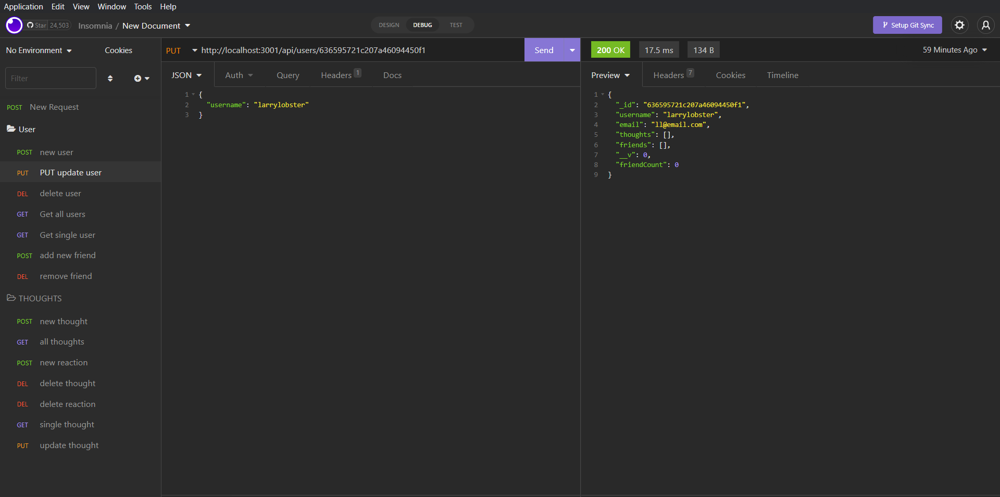
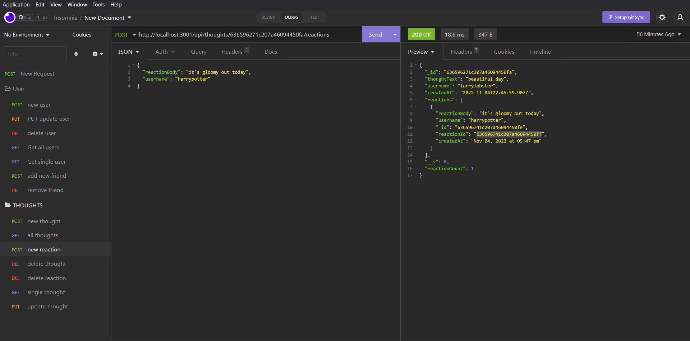
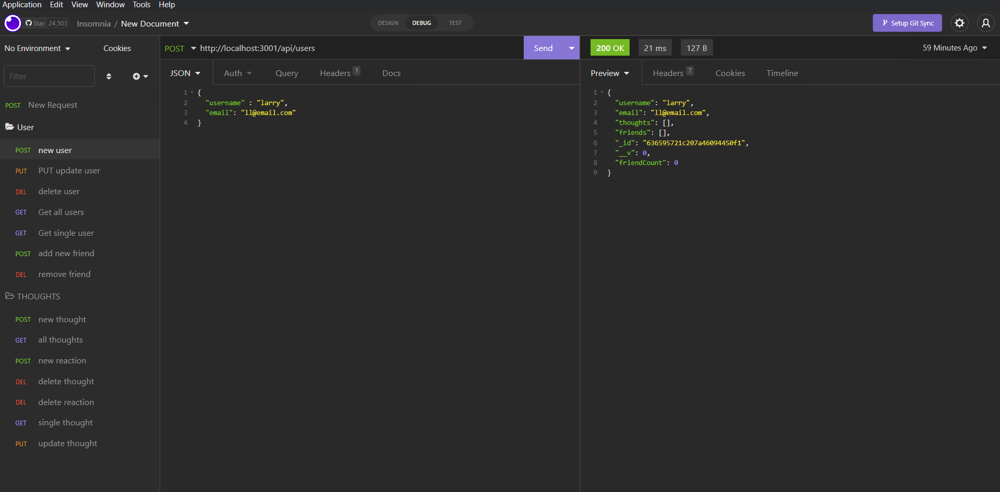

# Challenge18-Social Network API

## Description 
The challenge is to build an API for social network web application where users cab share their thoughts, react to friend's thoughts, and create a friend list.
You'll use Express.js fro routing, a MongoDB database, and the Mongoose ODM. In addition to using the Express.js and Mongoose packages, you may also optionally 
use a JavaScript library of your choice or the natice JavaScript date object to format timestamps.

## Installation
npm init npm install

## Screenshots

## Link to Video

https://youtu.be/P1W2pmJucgM
